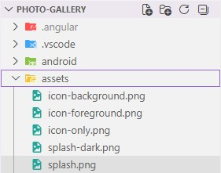
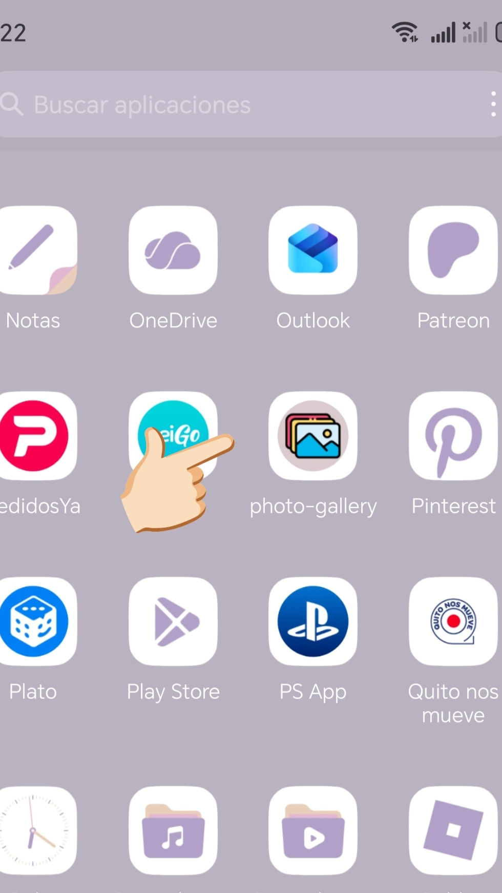
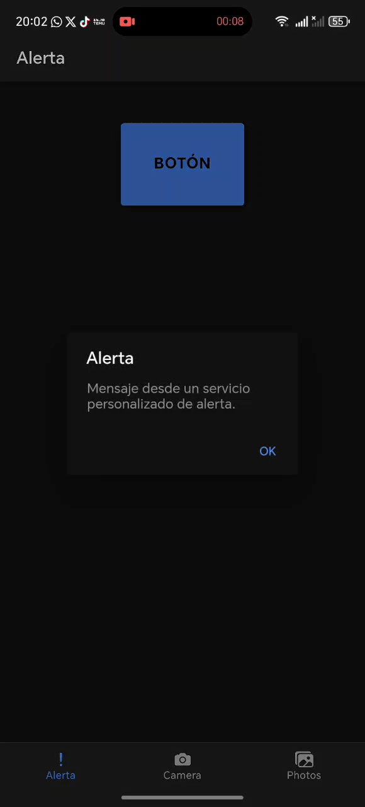
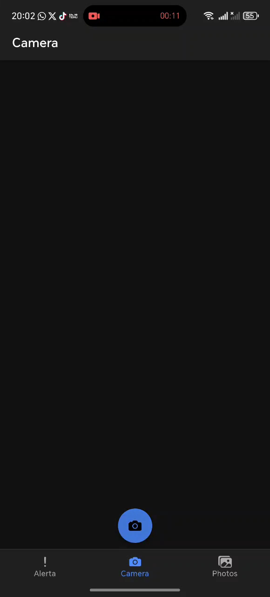
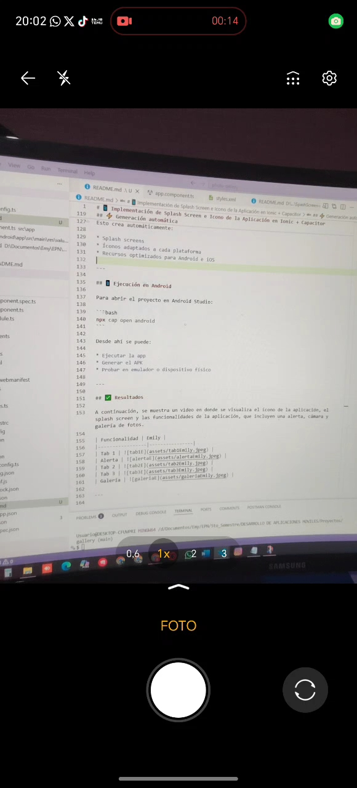
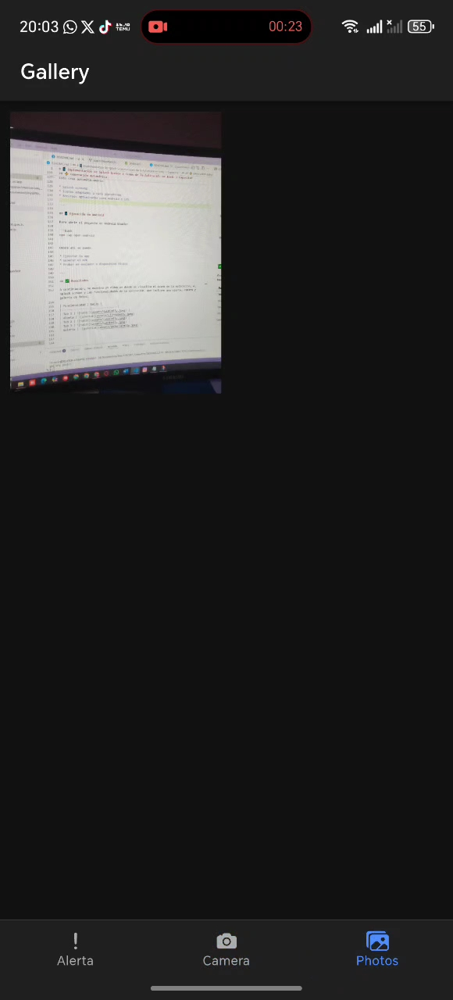

# 📱 Implementación de Splash Screen e Icono de la Aplicación Photo-Gallery

### 👤 Elaborado por:
- Emily Alejandra Galeas Tingo

## 📌 Descripción
- Aplicación móvil denominada Photo-Gallery desarrollada utilizando Ionic Framework y Capacitor.  
- La aplicación contiene diferentes funcionalidades como:
    * ⚠️ Mostrar una alerta al presionar un botón.
    * 📸 Acceso a la cámara para capturar imágenes.
    * 🖼️ Visualización de las imágenes tomadas dentro de la aplicación.
    * 📲​ Guardar imágenes en la propia galería del celular.
- Incluye un ícono representativo de la aplicación y una pantalla de carga antes de mostrar la aplicación.
- El archivo para descargar la aplicación en un dispositivo Android, se encuentra en el mismo repositorio.

---


## 🔧 Instalación del plugin

Para comenzar, se instala el plugin de Splash Screen:

```bash
npm install @capacitor/splash-screen
npx cap sync
```

---

## ⚙️ Configuración en Capacitor

Se configura el plugin en el archivo `capacitor.config.ts`, agregando la sección correspondiente a `SplashScreen` según la documentación oficial:

```ts
plugins: {
  SplashScreen: {
    launchShowDuration: 0,
    launchAutoHide: true,
    backgroundColor: "#ffffff",
    androidScaleType: "FIT_CENTER",
    showSpinner: false,
    splashFullScreen: true,
    splashImmersive: true,
  }
}
```

### 📌 Descripción de configuración

* `backgroundColor`: color de fondo del splash
* `launchShowDuration`: duración inicial (0 = control manual)
* `launchAutoHide`: oculta automáticamente
* `androidScaleType`: tipo de ajuste de imagen
* `splashFullScreen`: ocupa toda la pantalla
* `splashImmersive`: oculta barra de estado

📌 Documentación oficial:
https://ionicframework.com/docs/native/splash-screen

---

## 🧠 Implementación en la aplicación

En el archivo `app.component.ts` se crea una función asíncrona para controlar el Splash Screen manualmente:

```ts
import { SplashScreen } from '@capacitor/splash-screen';

  async showSplash(){
    await SplashScreen.show({
      autoHide: true,
      showDuration: 3000,
    });
  }
```

---

## 📦 Generación de plataformas

Se instalan las plataformas necesarias:

```bash
npm install @capacitor/android @capacitor/ios
```

Luego se construye la aplicación:

```bash
ionic build
```

Y se agregan las plataformas:

```bash
ionic cap add android
ionic cap add ios
```

---

## 🎨 Generación de Splash Screen e íconos

Se utiliza la herramienta oficial de Capacitor para generar automáticamente los recursos:

📌 **Documentación**:
https://capacitorjs.com/docs/guides/splash-screens-and-icons

### Instalación:

```bash
npm install @capacitor/assets
```

---

## 📁 Estructura de assets

Se crea una carpeta llamada `assets` en la raíz del proyecto, siguiendo la estructura indicada en la documentación (incluyendo imágenes base para icono y splash).

| Categoría                                | Detalle                                                                                                                               |
| ---------------------------------------- | ------------------------------------------------------------------------------------------------------------------------------------- |
| 📂 **Estructura de la carpeta `assets`** |assets/<br>├── icon-only.png<br>├── icon-foreground.png<br>├── icon-background.png<br>├── splash.png<br>└── splash-dark.png |
| 📏 **Dimensiones mínimas recomendadas**  | • Iconos: **1024 x 1024 px**<br>• Splash: **2732 x 2732 px**                                                                          |
| 🖼️ **Formatos de imagen**               | PNG o JPG                                                                                                                             |

De tal manera que la estructura de nuestro proyecto se vea así:

<p align="center">

</p>

---

## ⚡ Generación de recursos

Se ejecuta el siguiente comando para generar todos los recursos:

```bash
npx capacitor-assets generate
```

Esto crea automáticamente:

* Splash screens
* Íconos adaptados a cada plataforma
* Recursos optimizados para Android e iOS

---

## 📱 Ejecución en Android

Para abrir el proyecto en Android Studio:

```bash
ionic cap open android
```

Desde ahí se puede:

* Ejecutar la app
* Generar el APK
* Probar en emulador o dispositivo físico

---

## ✅ Resultados

A continuación, se muestra un video en donde se visualiza el ícono de la aplicación, el splash screen y las funcionalidades de la aplicación, que incluyen una alerta, cámara y galería de fotos.

https://github.com/user-attachments/assets/b6895754-ada3-4ba0-8698-8c2933432ff2

### 📸 Capturas de la aplicación

| 📱 Icono | ⚠️ Alerta | 📷 Cámara | 🖼️ Captura | 🗂️ Galería |
|----------|----------|----------|----------|----------|
|  |  |  |  |  |
